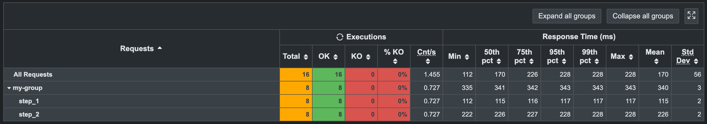
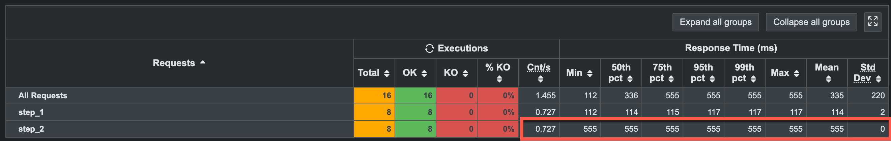
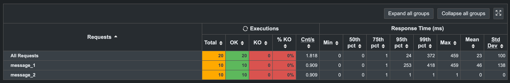
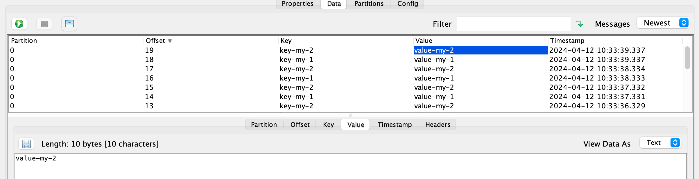

# Gatling Generic plugin
Plugin makes Gatling protocol agnostic load generator. You don't need anymore to take care of the
implementation of a tone of different details of every protocol in Gatling. Just put any piece of
code into `genericAction("name", session -> {})` and Gatling will do everything for you.

## Installation
As of now there is no any maven package or prebuilt `.jar` files to integrate into your project.
However, it's a matter only to download a few classes from this repository:
- `GenericAction` - scala class that takes care of `genericAction` executing and metrics handling
- `GenericCoreActionBuilder`
- `GenericActionBuilder`
- `GenericDsl` - java class that provides `genericAction` in a javaapi of Gatling

It's up to you to save, share and extend this minimum amount of classes to make your Gatling 
really powerful load generator out of the box.

## Running
To execute Gatling simulation:
1 run src/test/java/Engine.java
2 to specify simulation name use following property .simulationClass(SimpleExample.class.getName());

## Examples
This repository contains two examples in **[simulations](https://github.com/mklpanasiuk/gatling-generic-plugin/tree/main/src/test/java/simulations)** 
folder, one for emulating some work, and another one for Apache Kafka. Below you can look at basic ideas 
and examples of **Generic** plugin:

### Simple simulation

```java
public class SimpleExample extends Simulation {

    ScenarioBuilder scenario = scenario("FirstScenario")
        .exec(
            genericAction("step_1", session -> {
                Thread.sleep(111); // + try catch block
                return session;
            }),
            genericAction("step_2", session -> {
                Thread.sleep(222); // + try catch block
                return session;
            }),
            pause(1)
        );

    {
        setUp(scenario.injectClosed(constantConcurrentUsers(1).during(10)));
    }
}
```

In Html report and Graphite/InfluxDb metrics you will next:


It also works with Gatling groups, let's add them and see changes in report:
```java
public class SimpleExample extends Simulation {

    ScenarioBuilder scenario = scenario("FirstScenario")
        .group("my-group").on(
            exec(
                genericAction("step_1", session -> {
                    Thread.sleep(111); // + try catch block
                    return session;
                }),
                genericAction("step_2", session -> {
                    Thread.sleep(222); // + try catch block
                    return session;
                }),
                pause(1)
            ));

    {
        setUp(scenario.injectClosed(constantConcurrentUsers(1).during(10)));
    }
}
```

In the report and metrics you will see next:



**NOTE: `genericAction` by default measures the latency of the whole code block:**

```java
genericAction("step_2", session -> {
    // start timestamp
    
    Thread.sleep(222); // + try catch block
    return session;
    
    // end timestamp
})
```

Now let's imagine a case when in `genericAction` you are doing some preparation and other staff. Then
you are executing some call, you are interested only in the latency of that call, and you want to 
see in metrics only that value. In such case you can set to `latency` your own value:

```java
genericAction("step_2", session -> {
    Thread.sleep(222); // + try catch block

    session = session.set("latency", 555); // here is a way how to set your own value of the latency for this step

    return session;
})
```

In the report you will see next:



Also there can be a case when you want to modify the start time:

```java
genericAction("step_2", session -> {
    Thread.sleep(222); // + try catch block

    session = session.set("latency", 555); // here is a way how to set your own value of the latency for this step
    session = session.set("startTimestamp", Instant.now().toEpochMilli()); // change the start timestamp of the test

    return session;
})
```

### Kafka simulation

```java
public class KafkaExample extends Simulation {

    private ScenarioBuilder buildScenario(String name) {

        Properties props = new Properties();
        props.put("bootstrap.servers", "localhost:9092");
        props.put("key.serializer", "org.apache.kafka.common.serialization.StringSerializer");
        props.put("value.serializer", "org.apache.kafka.common.serialization.StringSerializer");

        var producer = new KafkaProducer<String, String>(props);
        var topic = "my-topic";

        var scenario = scenario(name)
            .exec(
                genericAction("message_1", session -> {
                    producer.send(new ProducerRecord<>(topic, "key-my-1", "value-my-1"));

                    return session;
                }),
                genericAction("message_2", session -> {
                    producer.send(new ProducerRecord<>(topic, "key-my-2", "value-my-2"));

                    return session;
                }),
                pause(1)
            );

        return scenario;
    }

    {
        setUp(buildScenario("FirstScenario").injectClosed(constantConcurrentUsers(1).during(10)));
    }
}
```

Html report:



Kafka topic has next messages:



## TBD

At the moment, **Generic** plugin works only for `javaapi` of the Gatling. Since Gatling supports `scala`,
`java` and `kotlin`, it is highly welcome to add support of missed languages. Contribute, please! I believe
in the power of OpenSource!

## Acknowledgments

Special thanks to **[dpychyk](https://github.com/dpychyk)** for his help with `scala`!


